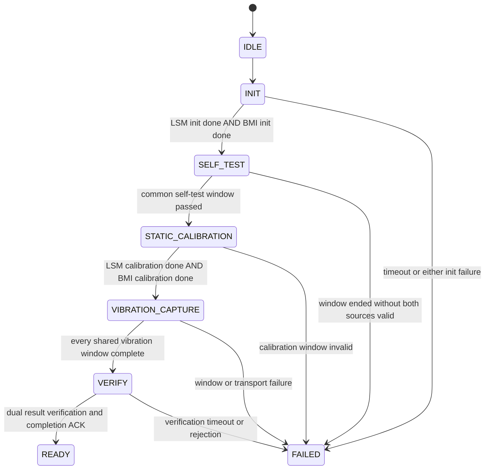

# Dual IMU Lifecycle Design

Status: IMPLEMENTED (build verified; hardware pending)

## Objective

`imu_boot_manager` owns one `DUAL_IMU_BOOT` lifecycle for LSM303 and BMI323.
The manager does not add BMI323 data to the existing LSM303 filter or attitude
path.

## Phase Contract

| Phase | Entry action | Completion condition | Time control |
| --- | --- | --- | --- |
| `IDLE` | Reset status and advertise boot readiness | Lifecycle start admitted | bounded synchronization guard |
| `INIT` | Start LSM I2C4 and BMI SPI1 init workers together | both workers complete successfully | init timeout |
| `SELF_TEST` | Start normal LSM/BMI acquisition in one phase | both sources have valid observations at common window end | fixed self-test window |
| `STATIC_CALIBRATION` | Keep PWM=0, wait settled, open one calibration window | both calibration result flags true | 10 s common capture window |
| `VIBRATION_CAPTURE` | For each PWM level, wait settled, open one vibration window | both vibration datasets complete at each window end | 30 s common capture window per PWM level |
| `VERIFY` | Validate dual result availability, send final event, retain filter gate | completion ACK and time guard pass | fixed verify window |
| `READY` / `FAILED` | Publish terminal state | terminal | timestamps retained |

Counters remain diagnostics only. They never decide a lifecycle transition.

## Status Contract

`SCBP_MSG_ID_DUAL_IMU_STATUS=0x0208` and App type `0x28` carry exactly 16
bytes: `phase`, `lsm_progress`, `bmi_progress`, `overall_progress`, `error`,
`flags`, `vibration_index`, `radar_pwm`, `phase_start_ms` (`u32 LE`), and
`phase_end_ms` (`u32 LE`). The S3 gateway changes only the envelope.

## Compatibility

`imu_boot_state_t` remains as a derived compatibility view for existing
calibration status, logging, and filter gating. The new `imu_phase_t` is the
single state-transition authority.

## Resource / Timing Notes

- INIT workers are temporary FreeRTOS tasks. I2C4 and SPI1 remain owned by
  their existing drivers; no ISR or DMA ownership changes are introduced.
- BMI acquisition stays at its configured ODR and avoids the 10 ms LSM task's
  filter/AHRS path.
- Shared windows use the existing monotonic timer. Vibration continues to
  accept per-source timestamps only inside one common interval.
- CM7 creates two lower-priority temporary INIT workers while `imu_task` owns
  the launch barrier, so neither worker can run before both task objects exist.
- `0x28` is emitted every 200 ms during lifecycle activity and is decoded into
  the App Developer Mode `DUAL_IMU_BOOT` card.
