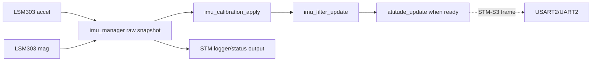
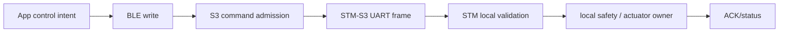
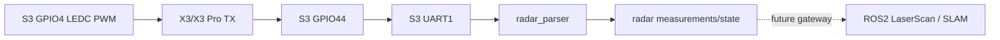

# Smart_Car Data Flow

## IMU Data

The manager updates accel and magnetometer paths independently, then publishes
a complete raw snapshot to calibration only when the cycle reports success.
Separate getter calls are not an atomic hardware snapshot.

## Control Data

The S3 admission and relay blocks are source gaps in the current checkout; the
diagram defines the intended ownership, not a completed route.

## Radar Data

Current S3 source reads and logs raw radar bytes. The exact model/checksum and
ROS2 integration remain unverified or planned.

## Status and Logs

- STM32 text logs use USART1 and the independent SmartCar Logger path.
- STM-S3 structured log frames use the C source frame and S3 log bridge.
- BLE log notifications use FFE3 and `SmartCarLogParser` on the App.
- App telemetry stores are MainActor-owned; BLE/parser work is isolated on the
  receive pipeline queue.
