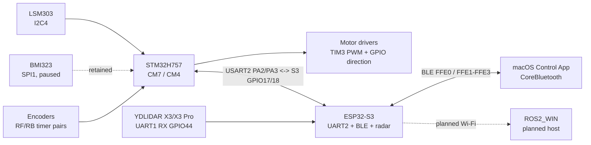
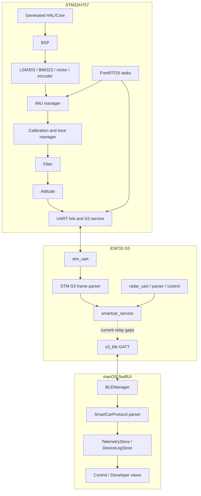
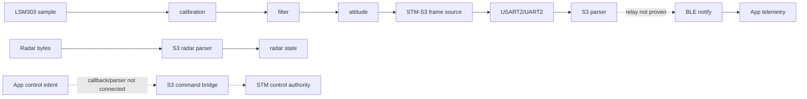
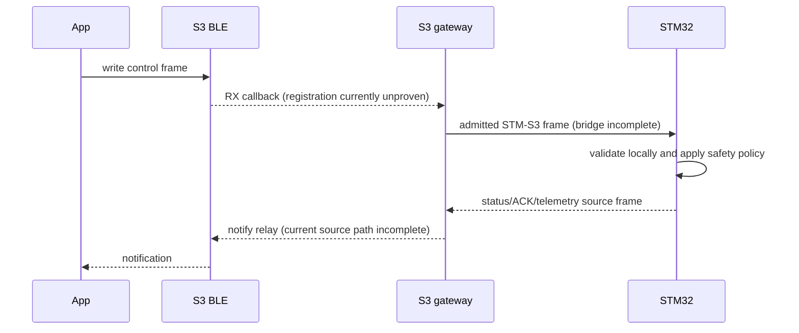

# Smart_Car System Architecture

## Function

Define ownership, boundaries, and the current implementation state of the
Smart_Car system. This is the canonical overview; protocol bytes and module
details live in linked pages.

## Current Stage

Phase 1 source exists for STM32H757, ESP32-S3, and the macOS control App.
Phase 2 radar/ROS2/SLAM/navigation is reserved. The diagrams describe source
boundaries, not end-to-end acceptance.

## Hardware Relationship

## Software Relationship

## Data Flow

## Control Flow

## Ownership

| Domain | Owner | Must not be delegated |
| --- | --- | --- |
| Final motion and local stop | STM32H757 | App, BLE, ROS2, or radar gateway |
| Sensor sampling/calibration/attitude | STM32H757 | App display or S3 inference |
| STM-S3 transport and gateway state | ESP32-S3 | App direct hardware access |
| Radar UART/PWM/parsing | ESP32-S3 | STM32 real-time motor loop |
| Operator UX | macOS App | Safety authority |
| SLAM/navigation/autonomy | ROS2_WIN, future | Direct motor electrical path |

## Known Gaps

- `s3_ble_set_rx_callback()` is defined but no current registration call is
  visible; App command admission is therefore incomplete.
- `imu_bridge_handle()` is empty; telemetry relay is not proven.
- App and STM-S3 frame layouts differ and require an explicit translation or a
  confirmed contract before integration.
- Physical UART, BLE, radar, sensor, motor, and vehicle evidence is absent from
  this static documentation task.
